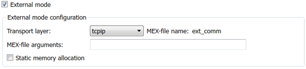
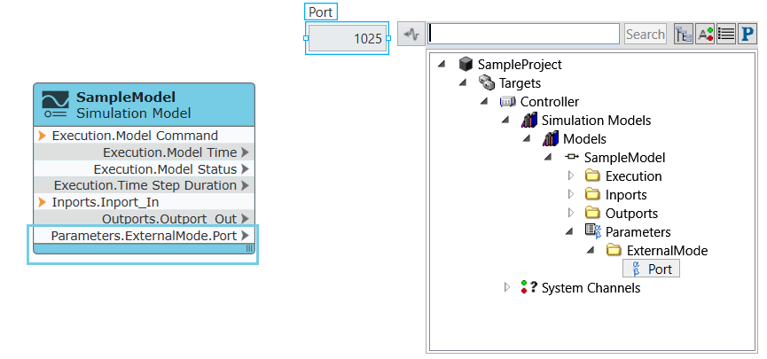

External mode simulation establishes a communication channel between
Simulink on your model development computer (host) and the model running
on NI hardware (target). This enables you to visualize signals and tune
parameters from Simulink.

1.  Open Model Configuration Parameters
2.  Navigate to Code Generation \> Interface.
3.  In the Data exchange interface section, enable External mode.
4.  In the External mode configuration section, set the Transport layer
    as \'tcpip\' or \'XCP on TCP/IP\'.

**Note:** For more information on related external mode settings, refer
to [External Mode Simulation with TCP/IP or Serial
Communication](https://www.mathworks.com/help/ecoder/ug/external-mode-simulation-with-tcpip-or-serial-communication.html)
or [External Mode Simulation with XCP
Communication.](https://www.mathworks.com/help/ecoder/ug/external-mode-simulation-with-xcp-communication.html)

**Note:** The parameter name ExternalMode/Port is reserved. Do not use
this name in your model.

## Establishing a Connection to Models Deployed in Windows/NI Linux Real-Time Systems

Models imported into a VeriStand system definition and deployed to
Windows/NI Linux Real-Time systems can also be connected from Simulink.

-  Determine the port number by examining the ExternalMode/Port
    parameter in VeriStand.

**Note:** When deploying a model compiled with external mode, VeriStand opens a controller port in the dynamic range of 1025 to 65536.

-  In the [MEX-filearguments](https://www.mathworks.com/help/rtw/ref/mex-file-arguments.html),specify the target IP address, port number. For XCP communication,specify symbols file name additionally.

    -   For symbols file name, specify the binary name. Example: \'SampleModel.so\'

-  In the [External Mode Control Panel](https://www.mathworks.com/help/ecoder/ug/external-mode-simulation-with-tcpip-or-serial-communication.html#f1014805),
    click Connect.

## External Mode Limitations

-   Deploying a model is not supported from Simulink when using
    veristand.tlc. You must deploy through VeriStand.
-   Starting or stopping a model from Simulink is not supported.
-   Connecting to a model is supported only when it is in running state.
